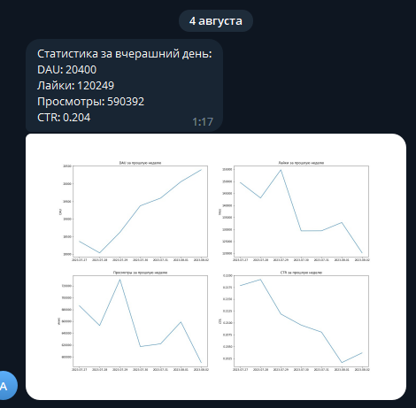
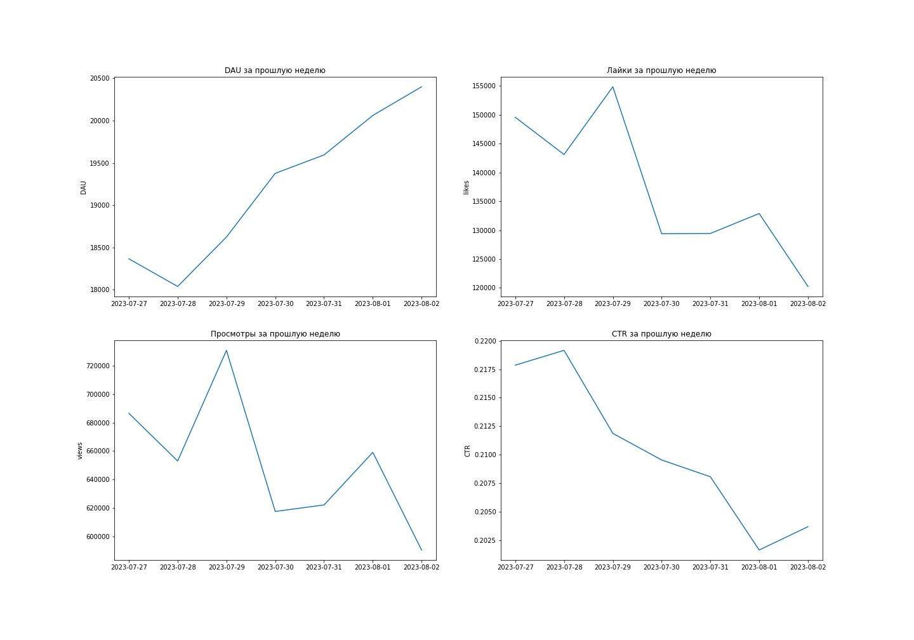

## 1. Построение ETL пайплайна ([dag.py](dag.py))

Необходимо построить ETL пайплайн. Ожидается, что на выходе будет DAG в airflow, который будет считаться каждый день за вчера. 
1. Параллельно будем обрабатывать две таблицы. В feed_actions для каждого юзера посчитаем число просмотров и лайков контента. В message_actions для каждого юзера считаем, сколько он получает и отсылает сообщений, скольким людям он пишет, сколько людей пишут ему. Каждая выгрузка должна быть в отдельном таске.
2. Далее объединяем две таблицы в одну.
3. Для этой таблицы считаем все эти метрики в разрезе по полу, возрасту и ос. Делаем три разных таска на каждый срез.
4. И финальные данные со всеми метриками записываем в отдельную таблицу в ClickHouse.
5. Каждый день таблица должна дополняться новыми данными. 
Структура финальной таблицы должна быть такая:
- Дата - event_date
- Название среза - dimension
- Значение среза - dimension_value
- Число просмотров - views
- Число лайков - likes
- Число полученных сообщений - messages_received
- Число отправленных сообщений - messages_sent
- От скольких пользователей получили сообщения - users_received
- Скольким пользователям отправили сообщение - users_sent
Срез - это os, gender и age

Таблица загружается в схему test.

## 2. Автоматизация отчетности ([dag_report.py](dag_report.py))

Задача состояла в построении отчета по ленте, который отправлялся бы в Telegram. Нужно было наладить автоматическую отправку аналитической сводки в телеграм каждое утро! 
Отчет должен состоять из двух частей:
- Текст с информацией о значениях ключевых метрик за предыдущий день
- График с значениями метрик за предыдущие 7 дней
- Отобразите в отчете следующие ключевые метрики: DAU, Просмотры, Лайки, CTR
  
Пример отчета: 

## 3. Реализация системы алертов ([dag_alert.py](dag_alert.py)

Система должна с периодичность каждые 15 минут проверять ключевые метрики, такие как активные пользователи в ленте / мессенджере, просмотры, лайки, CTR, количество отправленных сообщений. 

Изучите поведение метрик и подберите наиболее подходящий метод для детектирования аномалий. На практике как правило применяются статистические методы. 
В самом простом случае можно, например, проверять отклонение значения метрики в текущую 15-минутку от значения в такую же 15-минутку день назад. 

В случае обнаружения аномального значения, в чат должен отправиться алерт - сообщение со следующей информацией: метрика, ее значение, величина отклонения.
В сообщение можно добавить дополнительную информацию, которая поможет при исследовании причин возникновения аномалии, это может быть, например,  график, ссылки на дашборд/чарт в BI системе. 

