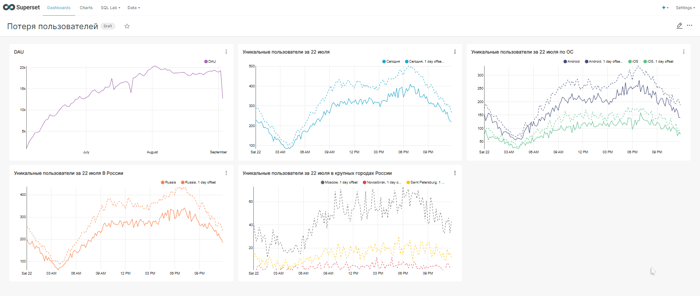

## Аномалия новых пользователей

Мы наблюдаем внезапное падение активной аудитории 22 июля! Нужно разобраться, какие пользователи не смогли зайти в приложение, что их объединяет?  

Построим дашборд для ответа на этот вопрос.

На дашборде можем увидеть метрику DAU за весь период, на которой мы наблюдаем спад числа пользователей 22 июля. Следующий график это снова метрика DAU, но уже за 1 день - 22 июля. Мы видим, что число пользователей за 22 июля было на протяжении всего дня меньше чем число пользователей за 21 июля. Если сравнить пользователей по ОС, можно заметить, что наибольшее число пользователей потерялось с ОС Android. Если сделать сравнение по странам, то наибольший отток пользователей был в России. Причем отток был во всех крупных городах, а наибольший в Москве. Возможно в приложении произошел какой-то сбой.
