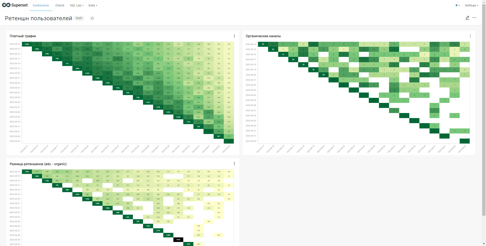

В наших данных использования ленты новостей есть два типа юзеров: те, кто пришел через платный трафик source = 'ads', и те, кто пришел через органические каналы source = 'organic'.

Задача — проанализировать и сравнить Retention этих двух групп пользователей. Решением этой задачи будет ответ на вопрос: отличается ли характер использования приложения у этих групп пользователей. 

Для решения зачаи был построен следующий дашборд.

На дашборде сравнивается ретеншен двух групп пользователей: пришедших через платный трафик и через органические каналы. Пользователей пришедших по платному трафику гораздо больше, чем по органическому. Также пользователи, которые пришли через органические каналы, дольше остаются активными, а пользователи, пришедшие через платный трафик быстрее покидают наше приложение. Таким образом аудитория из органических каналов более лояльная нежели платная, но платной аудитории гораздо больше.
